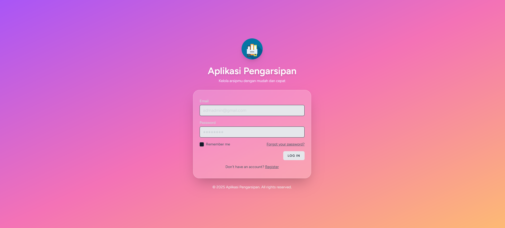
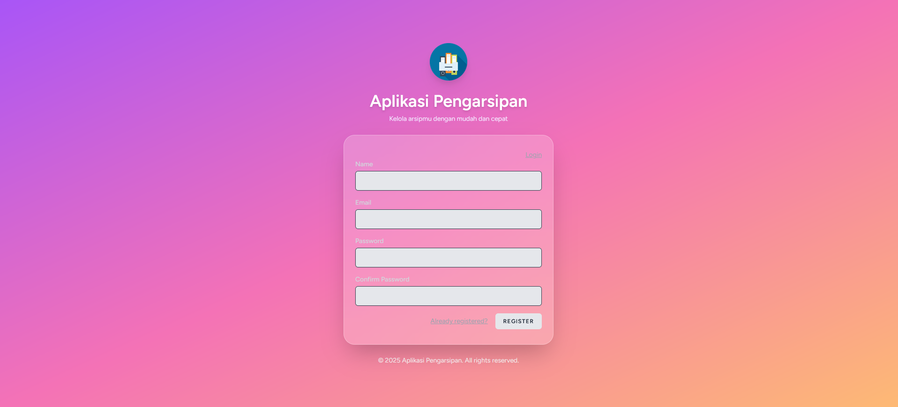
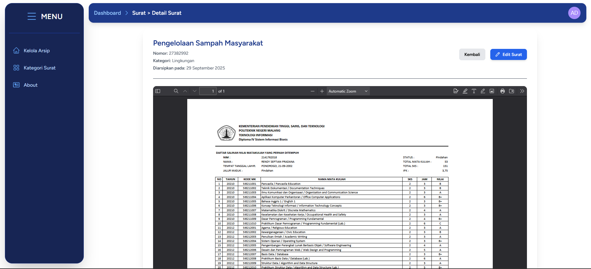
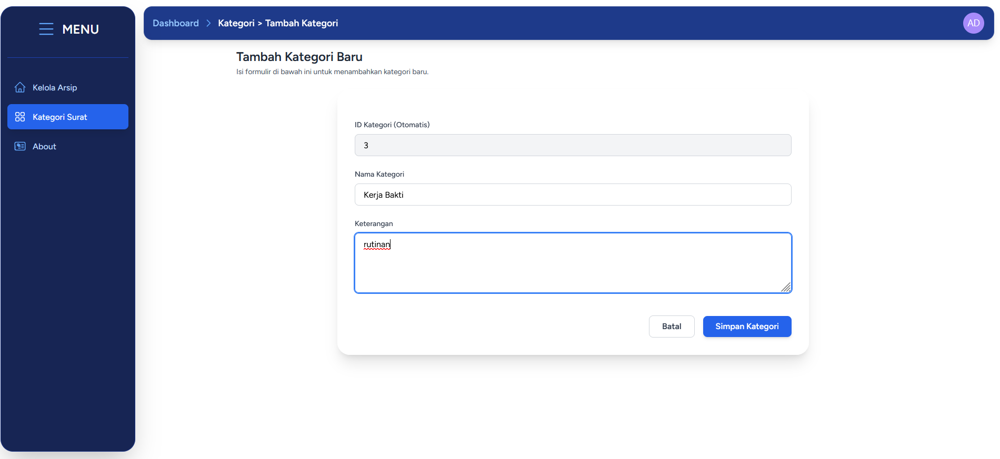
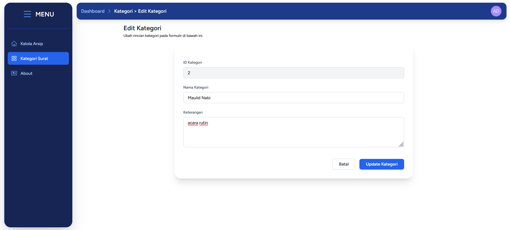
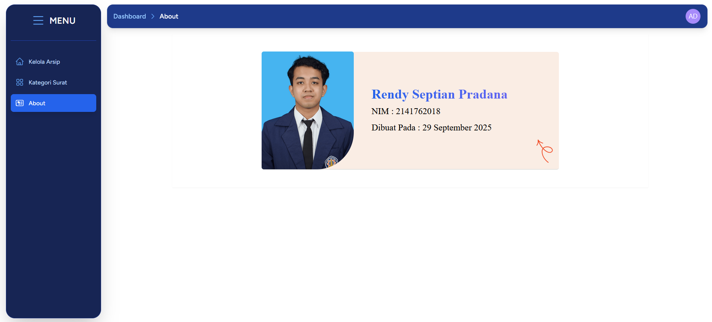

ARSIP SURAT DESA KARANGDUREN

<h1>Tujuan</h1>
Aplikasi Arsip Surat Desa Karangduren dirancang untuk mempermudah pengelolaan arsip digital agar lebih terstruktur, aman, dan mudah diakses. Aplikasi ini khususnya membantu instansi atau organisasi dalam menyimpan surat-surat resmi dalam format PDF sehingga dapat dengan mudah dicari dan diunduh saat dibutuhkan. Dengan sistem ini, proses pengarsipan menjadi efisien dan mendukung kelancaran administrasi.

<h1>Fitur</h1>
Pendaftaran dan masuk pengguna

Dashboard yang menampilkan ringkasan arsip

Pengelolaan arsip surat meliputi penambahan, pengeditan, peninjauan, dan penghapusan

Mengunduh surat dalam format PDF

Mengekspor data arsip surat ke file CSV

Mencari arsip surat berdasarkan judul

Pengelolaan kategori surat termasuk tambah, edit, lihat, dan hapus

Melihat informasi profil pengguna

Fitur untuk mengganti kata sandi

Opsi untuk menghapus akun pengguna

Halaman “About” yang berisi informasi tentang pengembang aplikasi

Fitur keluar dari sistem (logout)

<h1>Cara Menjalankan Aplikasi</h1>
Clone Repository

git clone (https://github.com/Rendyseptch/pengarsipan-surat.git)
cd arsip-app

-Install Dependensi
Gunakan Composer untuk dependensi backend dan NPM untuk dependensi frontend.

-composer install
npm install

-Konfigurasi Environment
Salin file .env.example menjadi .env dan sesuaikan konfigurasi database Anda (nama database, username, password).

cp .env.example .env

Generate Application Key

php artisan key:generate

Setup Database
Buat database baru di phpMyAdmin (atau sejenisnya) sesuai nama yang Anda atur di file .env. Setelah itu, impor file database.sql yang tersedia di dalam repository.

Jalankan Server
Buka dua terminal. Di terminal pertama, jalankan Vite. Di terminal kedua, jalankan server Laravel.

# Terminal 
npm run dev

# Terminal 
php artisan serve

Screenshot Aplikasi
Halaman Login & Register

Halaman About

Dashboard & Manajemen Arsip
Dashboard

Fungsionalitas Arsip

Manajemen Kategori

Halaman Profil

